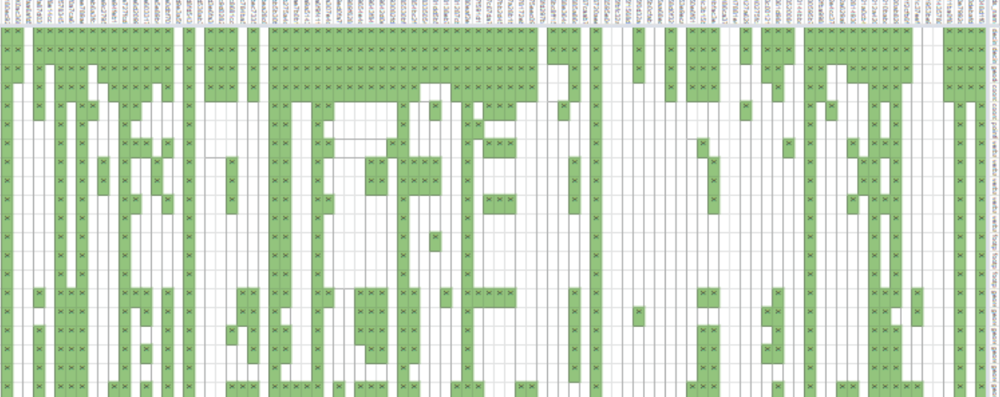
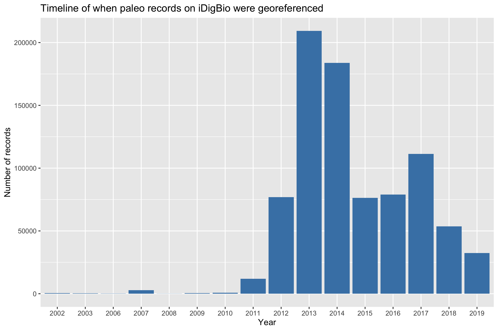
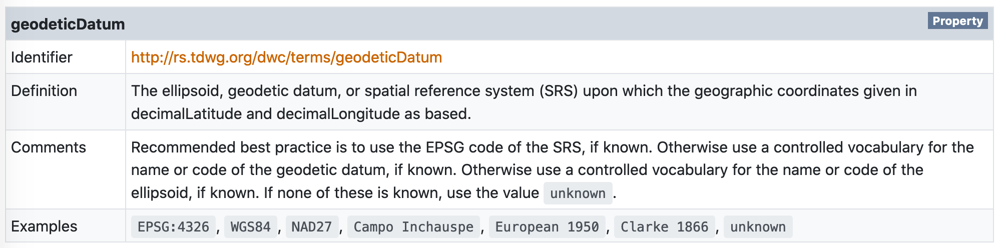
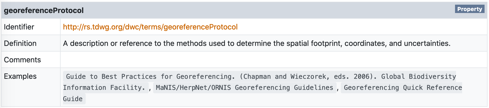
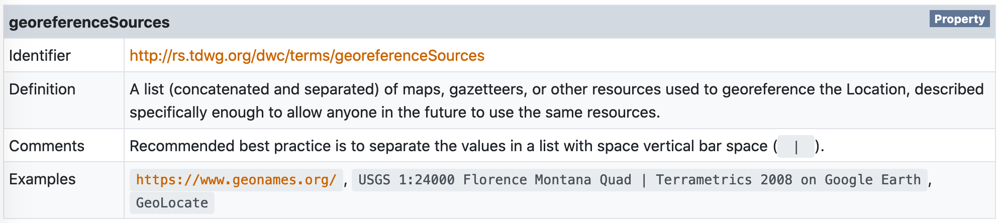

------

### Overview

------

This document was prepared for the virtual workshop, [Georeferencing for Paleo: Refreshing the approach to fossil localities](https://tdwg.github.io/esp/georeferencing/2020-workshop). Our goal here is to explore the georeferenced data that paleontological collections are currently providing to biodiversity data aggregators, namely iDigBio and GBIF. In particular, we want to know...

1. How prevalent is georeferencing in our data? (_Workshop Day 1_)
1. What standard terms are in use?  (_Workshop Day 1_)
1. How are standard terms being used? (_Workshop Day 2_)

```{r warning = FALSE, message = FALSE}
# Load core libraries; install these packages if you have not already
library(ridigbio)
library(tidyverse)
library(wordcloud)

# Load library for making nice HTML output
library(kableExtra)
```
```{r global_options, include = FALSE}
# Set global chunk options
knitr::opts_chunk$set(warning = FALSE,
                      message = FALSE,
                      results = 'asis')
```

------

#### What data are we looking at?

Data in this example (unless otherwise noted) was downloaded from iDigBio on 2020-02-04 using the query: `basisofrecord` = "fossilspecimen." A data download from iDigBio includes both the raw data, as published by the data provider (e.g. the collection), and a second version of the same data which has been processed by iDigBio. You can learn more about what the difference between raw and processed recordsets contained in an iDigBio data download in [this blog post](https://www.idigbio.org/content/understanding-idigbios-data-downloads).

```{r}
# Read into R the raw occurrence data, which should be whatever was published by
# the data provider (e.g. the collection)
raw_idb <- read_csv("4336327f-dae0-4877-9d6d-460cb3a6ef13/occurrence_raw.csv", 
                    na = character(),
                    col_types = cols())

# Read into R the version of occurrence data processed by iDigBio
processed_idb <- read_csv("4336327f-dae0-4877-9d6d-460cb3a6ef13/occurrence.csv", 
                          na = character(),
                          col_types = cols())

# Count how many total records are present in `processed_idb`
records_total <- nrow(processed_idb)

# Count how many records are georeferenced in `processed_idb`
records_georef <- processed_idb %>% 
  filter(`idigbio:geoPoint` != "") %>% 
  nrow()
```

Our data here are comprised of **57 provider datasets** representing a total of **`r format(records_total, big.mark = ",")` specimen records**.

<center> _Example of what the raw provider data look like_ </center>

&nbsp;

```{r echo = FALSE}
knitr::kable(head(raw_idb)) %>% 
    kable_styling(bootstrap_options = 
                         c("striped", "hover", "condensed", "responsive")) %>% 
  scroll_box(width = "100%", height = "400px")
```

&nbsp;
&nbsp;

<center> _Example of what the data look like after being processed by iDigBio_ </center>

&nbsp;

```{r echo = FALSE}
knitr::kable(head(processed_idb)) %>% 
    kable_styling(bootstrap_options = 
                         c("striped", "hover", "condensed", "responsive")) %>% 
  scroll_box(width = "100%", height = "400px")
```

------

### 1. How prevalent is georeferencing in our data??

------

Of these records, **`r round(sum(records_georef/records_total*100), 1)`% are georeferenced**. The majority of this georeferencing has been done in the recent past.

```{r}
# Collate data about when records were georeferenced, based on data provided
# in the column `data.dwc:georeferencedDate`
georef_timeline <- raw_idb %>% 
  select(`dwc:georeferencedDate`) %>% 
  filter(!is.na(`dwc:georeferencedDate`) & `dwc:georeferencedDate` != "") %>%
  mutate(date = lubridate::as_date(`dwc:georeferencedDate`)) %>% 
  mutate(year1 = lubridate::year(date)) %>% 
  mutate(year2 = case_when(is.na(year1) ~ `dwc:georeferencedDate`)) %>% 
  unite(year, c(year1, year2), sep = " ", na.rm = TRUE) %>% 
  mutate(year = str_trim(str_replace(year, "NA", ""))) %>% 
  group_by(year) %>% 
  tally() %>%
  filter(nchar(year) == 4 & year > 2000 & year < 2021)

# Plot `georef_timeline`
 ggplot(georef_timeline, aes(x = year, y = n)) + 
   geom_bar(stat = "identity", fill = "steelblue") +
   ggtitle("Timeline of when paleo records on iDigBio were georeferenced") +
   xlab("Year") +
   ylab("Number of records")
```

------

### 2. What standard terms are in use?

------

#### At the recordset level

Data for the figure below were downloaded from GBIF on 2020-04-23 using the query: `basisofrecord` = "fossil" ([doi.org/10.15468/dl.7nnj39](https://doi.org/10.15468/dl.7nnj39)). This dataset includes **1,1665,493 specimen records** provided by **>90 collections**.



<center> _Presence/absence of georeferencing terms in use by paleo collections providing data to GBIF_ </center>

&nbsp;

In the figure above, data providers are columns and Darwin Core fields are rows. Green indicates the presence of a particular Darwin Core field in data published by a provider, though the fact that a field is present does not necessarily mean that there are values in it. The takeaway from this figure is that **only three standard Darwin Core fields related to georeferencing are in use by the majority of data providers**. The top fields used by paleo collections providing data to GBIF are:

1. **dwc:decimalLatitude** and **dwc:decimalLongitude** (in use by 78% of data providers)
1. **dwc:geodeticDatum** (in use by 70% of data providers)
1. **dwc:coordinateUncertaintyInMeters** (in use by 57% of data providers)
1. **dwc:georeferenceRemarks** (in use by 48% of data providers)
1. **dwc:georeferencedBy** (in use by 42% of data providers)

------

#### At the record level

Data for the figure below is from the iDigBio dataset introduced at the beginning of this document.

```{r}
# Summarize frequency of metadata for georeference data
perc_geodeticDatum <- raw_idb %>% 
  select(`dwc:geodeticDatum`) %>% 
  filter(!is.na(`dwc:geodeticDatum`) & `dwc:geodeticDatum` != "") %>% 
  nrow()

# Summarize frequency of metadata for georeference data
perc_coordinateUncertaintyInMeters <- raw_idb %>% 
  select(`dwc:coordinateUncertaintyInMeters`) %>% 
  filter(!is.na(`dwc:coordinateUncertaintyInMeters`) & 
           `dwc:coordinateUncertaintyInMeters` != "") %>% 
  nrow()

# Summarize frequency of metadata for georeference data
perc_coordinatePrecision <- raw_idb %>% 
  select(`dwc:coordinatePrecision`) %>% 
  filter(!is.na(`dwc:coordinatePrecision`) & `dwc:coordinatePrecision` != "") %>% 
  nrow()

# Summarize frequency of metadata for georeference data
perc_georeferencedBy <- raw_idb %>% 
  select(`dwc:georeferencedBy`) %>% 
  filter(!is.na(`dwc:georeferencedBy`) & `dwc:georeferencedBy` != "") %>% 
  nrow()

# Summarize frequency of metadata for georeference data
perc_georeferencedDate <- raw_idb %>% 
  select(`dwc:georeferencedDate`) %>% 
  filter(!is.na(`dwc:georeferencedDate`) & `dwc:georeferencedDate` != "") %>% 
  nrow()

# Summarize frequency of metadata for georeference data
perc_georeferenceProtocol <- raw_idb %>% 
  select(`dwc:georeferenceProtocol`) %>% 
  filter(!is.na(`dwc:georeferenceProtocol`) & `dwc:georeferenceProtocol` != "") %>% 
  nrow()

# Summarize frequency of metadata for georeference data
perc_georeferenceSources <- raw_idb %>% 
  select(`dwc:georeferenceSources`) %>% 
  filter(!is.na(`dwc:georeferenceSources`) & `dwc:georeferenceSources` != "") %>% 
  nrow()

# Summarize frequency of metadata for georeference data
perc_georeferenceVerificationStatus <- raw_idb %>% 
  select(`dwc:georeferenceVerificationStatus`) %>% 
  filter(!is.na(`dwc:georeferenceVerificationStatus`) & 
           `dwc:georeferenceVerificationStatus` != "") %>% 
  nrow()

# Summarize frequency of metadata for georeference data
perc_georeferenceRemarks <- raw_idb %>% 
  select(`dwc:georeferenceRemarks`) %>% 
  filter(!is.na(`dwc:georeferenceRemarks`) & `dwc:georeferenceRemarks` != "") %>% 
  nrow()

# Summarize frequency of metadata for georeference data
perc_dataGeneralizations <- raw_idb %>% 
  select(`dwc:dataGeneralizations`) %>% 
  filter(!is.na(`dwc:dataGeneralizations`) & `dwc:dataGeneralizations` != "") %>% 
  nrow()

# Summarize frequency of metadata for georeference data
perc_informationWithheld <- raw_idb %>% 
  select(`dwc:informationWithheld`) %>% 
  filter(!is.na(`dwc:informationWithheld`) & `dwc:informationWithheld` != "") %>% 
  nrow()

# Collate summary data into a single data frame
percSummary <- tribble(
  ~field, 
  ~yes, 
  ~no,
  "geodeticDatum", 
  perc_geodeticDatum, 
  sum(records_total-perc_geodeticDatum),
  "coordinateUncertaintyInMeters", 
  perc_coordinateUncertaintyInMeters, 
  sum(records_total-perc_coordinateUncertaintyInMeters),
  "coordinatePrecision", 
  perc_coordinatePrecision, 
  sum(records_total-perc_coordinatePrecision),
  "georeferencedBy", 
  perc_georeferencedBy, 
  sum(records_total-perc_georeferencedBy),
  "georeferencedDate", 
  perc_georeferencedDate, 
  sum(records_total-perc_georeferencedDate),
  "georeferenceProtocol", 
  perc_georeferenceProtocol, 
  sum(records_total-perc_georeferenceProtocol),
  "georeferenceSources", 
  perc_georeferenceSources, 
  sum(records_total-perc_georeferenceSources),
  "georeferenceVerificationStatus", 
  perc_georeferenceVerificationStatus, 
  sum(records_total-perc_georeferenceVerificationStatus),
  "georeferenceRemarks", 
  perc_georeferenceRemarks, 
  sum(records_total-perc_georeferenceRemarks),
  "dataGeneralizations", 
  perc_dataGeneralizations, 
  sum(records_total-perc_dataGeneralizations),
  "informationWithheld", 
  perc_informationWithheld, 
  sum(records_total-perc_informationWithheld))

# Plot `percSummary`
percSummary_plot <- percSummary %>% 
  pivot_longer(-field, names_to = "inUse", values_to = "count") %>%
  group_by(field) %>% 
  mutate(perc = round(count/sum(count)*100)) %>%
  mutate(ypos = cumsum(perc)- 0.5*perc ) %>% 
  ggplot(aes(x = 0, y = count, fill = inUse)) +
  geom_bar(stat = "identity", color = "black") +
  coord_polar(theta = "y") +
  facet_wrap(~field) +
  labs(title = "Percentage of records with values in georeference metadata fields",
       fill = "In use?") +
  theme_void() +
  theme(plot.title = element_text(margin = margin(10, 0, 10, 0))) +
  scale_fill_manual(values = c("white", "steelblue"))

# Save `percSummary_plot` as a file
ggsave("percSummary_plot.png", width = 9, height = 6, units = "in")
```



------

### 3. How are standard terms being used?

------

#### Geodetic Datum



```{r}
# Determine unique values for `dwc:geodeticDatum`
geodeticDatum <- raw_idb %>% 
  group_by(`dwc:geodeticDatum`) %>% 
  filter(!is.na(`dwc:geodeticDatum`) & `dwc:geodeticDatum` != "") %>% 
  tally() %>% 
  arrange(desc(n)) %>% 
  rename(value = `dwc:geodeticDatum`)

# Generate wordcloud based on frequency of values
wordcloud(words = geodeticDatum$value, 
          freq = geodeticDatum$n, 
          min.freq = 1,
          max.words = 200,
          random.order = FALSE,
          rot.per = 0.25,
          colors = brewer.pal(8, "Dark2"))
```

_Unique values present in the `dwc:geodeticDatum` field_

&nbsp;

```{r echo = FALSE}
knitr::kable(geodeticDatum) %>% 
    kable_styling(bootstrap_options = 
                         c("striped", "hover", "condensed", "responsive")) %>% 
  scroll_box(width = "100%", height = "200px")
```

&nbsp;

------

#### Georeference Protocol



```{r}
# Determine unique values for `dwc:georeferenceProtocol`
georeferenceProtocol <- raw_idb %>% 
  group_by(`dwc:georeferenceProtocol`) %>% 
  filter(!is.na(`dwc:georeferenceProtocol`) & `dwc:georeferenceProtocol` != "") %>% 
  tally() %>% 
  arrange(desc(n)) %>% 
  rename(value = `dwc:georeferenceProtocol`)

# Generate wordcloud based on frequency of values
wordcloud(words = georeferenceProtocol$value, 
          freq = georeferenceProtocol$n, 
          min.freq = 1,
          max.words = 200,
          random.order = FALSE,
          rot.per = 0.25,
          colors = brewer.pal(8, "Dark2"))
```

_Unique values present in the `dwc:georeferenceProtocol` field_

&nbsp;

```{r echo = FALSE}
knitr::kable(georeferenceProtocol) %>% 
    kable_styling(bootstrap_options = 
                         c("striped", "hover", "condensed", "responsive")) %>% 
  scroll_box(width = "100%", height = "200px")

```

&nbsp;

------

#### Georeference Sources



```{r}
# DEtermine unique values for `dwc:georeferenceSources`
georeferenceSources <- raw_idb %>% 
  group_by(`dwc:georeferenceSources`) %>% 
  filter(!is.na(`dwc:georeferenceSources`) & `dwc:georeferenceSources` != "") %>% 
  tally() %>% 
  arrange(desc(n)) %>% 
  rename(value = `dwc:georeferenceSources`)

# Generate wordcloud based on frequency of values
wordcloud(words = georeferenceSources$value, 
          freq = georeferenceSources$n, 
          min.freq = 1,
          max.words = 200,
          random.order = FALSE,
          rot.per = 0.25,
          colors = brewer.pal(8, "Dark2"))
```

_Unique values present in the `dwc:georeferenceSources` field_

&nbsp;

```{r echo = FALSE}
knitr::kable(georeferenceSources) %>% 
  kable_styling(bootstrap_options = 
                         c("striped", "hover", "condensed", "responsive")) %>% 
  scroll_box(width = "100%", height = "200px") 
```

&nbsp;

------

#### Precision

Let's take a more detailed look at the precision of coordinates provided. When we talk about _precision_ in this context we mean "the number of digits after the decimal point on a latitude or longitude that is recorded in decimal degrees." Precision is a measure of the exactness of the latitude and longitude coordinates compared to reality. This comic illustrates the concept of precision well:


```{r}
# Summarize precision for all records
precision <- raw_idb %>% 
  select(`dwc:decimalLatitude`, `dwc:decimalLongitude`) %>% 
  filter(!is.na(`dwc:decimalLatitude`) | !is.na(`dwc:decimalLongitude`)) %>% 
  mutate(lat = as.character(`dwc:decimalLatitude`)) %>% 
  mutate(lon = as.character(`dwc:decimalLongitude`)) %>% 
  separate(lat, c("int_lat", "dec_lat"), sep = "\\.") %>% 
  separate(lon, c("int_lon", "dec_lon"), sep = "\\.") %>% 
  mutate(precision_lat = str_length(dec_lat)) %>% 
  mutate(precision_lon = str_length(dec_lon)) %>% 
  mutate(precision_lat = recode(precision_lat, "1" = "0.1", 
                                "2" = "0.01",
                                "3" = "0.001",
                                "4" = "0.0001",
                                "5" = "0.00001",
                                "6" = "0.000001",
                                "7" = "0.0000001",
                                "8" = "0.00000001",
                                "9" = "0.000000001",
                                "10" = "0.0000000001")) %>% 
   mutate(precision_lon = recode(precision_lon, "1" = "0.1", 
                                "2" = "0.01",
                                "3" = "0.001",
                                "4" = "0.0001",
                                "5" = "0.00001",
                                "6" = "0.000001",
                                "7" = "0.0000001",
                                "8" = "0.00000001",
                                "9" = "0.000000001",
                                "10" = "0.0000000001")) %>% 
  group_by(precision_lat, precision_lon) %>% 
  summarise(n = n()) %>% 
  arrange(desc(n)) %>% 
  mutate(percent = round(n/2351102*100, 1)) %>% 
  rename(count = n)
```

&nbsp;

Precision is an essential concept for paleo collections because reducing precision (typically by truncating decimals) is a common method we use to obscure locality data when sharing it widely.

_Summary of precision in georeferenced data, determined from coordinate fields_

&nbsp;

```{r echo = FALSE}
knitr::kable(precision) %>% 
    kable_styling(bootstrap_options = 
                         c("striped", "hover", "condensed", "responsive",
                           fixed_thead = TRUE)) %>% 
  scroll_box(width = "50%", height = "200px")
```

&nbsp;

------

### What kind of values do we see in other metadata fields?

**Possible fields to look at:**

- dwc:georeferencedBy
- dwc:georeferenceRemarks
- dwc:verbatimElevation
- dwc:minimumElevationInMeters
- dwc:maximumElevationInMeters
- dwc:maximumDepthInMeters
- dwc:minimumDepthInMeters
- dwc:coordinateUncertaintyInMeters
- dwc:footprintSRS
- dwc:footprintSpatialFit
- dwc:footprintWKT
- dwc:pointRadiusSpatialFit
- dwc:verbatimCoordinateSystem
- dwc:verbatimCoordinates
- dwc:verbatimDepth
- dwc:verbatimLatitude
- dwc:verbatimLocality
- dwc:verbatimLongitude
- dwc:verbatimSRS

```{r}
# Unique values ? for...

# dwc:georeferencedBy
# dwc:georeferenceRemarks
# dwc:verbatimElevation
# dwc:minimumElevationInMeters
# dwc:maximumElevationInMeters
# dwc:maximumDepthInMeters
# dwc:minimumDepthInMeters
# dwc:coordinateUncertaintyInMeters
# dwc:footprintSRS
# dwc:footprintSpatialFit
# dwc:footprintWKT
# dwc:pointRadiusSpatialFit
# dwc:verbatimCoordinateSystem
# dwc:verbatimCoordinates
# dwc:verbatimDepth
# dwc:verbatimLatitude
# dwc:verbatimLocality
# dwc:verbatimLongitude
# dwc:verbatimSRS
```

------

### What can we say about localities?

**Possible geographic fields to look at:**

- dwc:geologicalContextID
- dwc:lithostratigraphicTerms
- dwc:lowestBiostratigraphicZone
- dwc:fieldNumber
- dwc:locality
- dwc:locationAccordingTo
- dwc:locationID
- dwc:locationRemarks

**Possible lithostratigraphic fields to look at:**

- dwc:bed
- dwc:member
- dwc:formation
- dwc:earliestAgeOrLowestStage
- dwc:earliestEonOrLowestEonothem
- dwc:earliestEpochOrLowestSeries
- dwc:earliestEraOrLowestErathem
- dwc:earliestPeriodOrLowestSystem
- dwc:latestAgeOrHighestStage
- dwc:latestEonOrHighestEonothem
- dwc:latestEpochOrHighestSeries
- dwc:latestEraOrHighestErathem
- dwc:latestPeriodOrHighestSystem

```{r}
# Unique values ? for...

# dwc:geologicalContextID
# dwc:lithostratigraphicTerms
# dwc:lowestBiostratigraphicZone
#	dwc:fieldNumber
#	dwc:locality
#	dwc:locationAccordingTo
# dwc:locationID
# dwc:locationRemarks

# Unique values ? for lithostratigraphic fields

# dwc:bed
# dwc:member
# dwc:formation
# dwc:earliestAgeOrLowestStage
# dwc:earliestEonOrLowestEonothem
# dwc:earliestEpochOrLowestSeries
# dwc:earliestEraOrLowestErathem
# dwc:earliestPeriodOrLowestSystem
# dwc:latestAgeOrHighestStage
# dwc:latestEonOrHighestEonothem
# dwc:latestEpochOrHighestSeries
# dwc:latestEraOrHighestErathem
# dwc:latestPeriodOrHighestSystem
```

------

### Who is contributing this data?

```{r}
# Unique values ? for...

# dwc:institutionCode
# dwc:institutionID
# dwc:collectionCode
# dwc:collectionID
# dwc:datasetID
# dwc:datasetName

# Unique values for `dwc:basisOfRecord` but beyond this dataset
```

------

### What kind of data cleaning is conducted by aggregators?

```{r}
# Look at geopoints
# Country cleanup?
```
