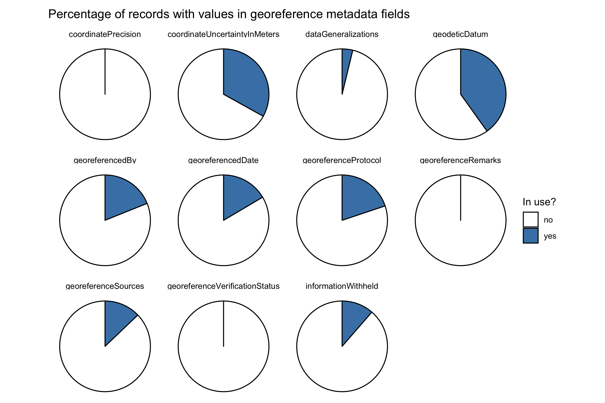

------

### Overview

------

Our goal here is to explore the georeferenced data that paleontological collections are currently providing to iDigBio. In particular, we want to know...

1. How prevalent is georeferencing in our data?
1. What standard terms are in use?
1. How are standard terms being used?

```{r warning = FALSE, message = FALSE}
# Load core libraries; install these packages if you have not already
library(ridigbio)
library(tidyverse)
library(wordcloud)

# Load library for making nice HTML output
library(kableExtra)
```
```{r global_options, include = FALSE}
# Set global chunk options for knitr
knitr::opts_chunk$set(warning = FALSE, 
                      message = FALSE,
                      echo = FALSE,
                      results = 'asis')
```

------

#### What data are we looking at?

Data in this example was downloaded from iDigBio on 2020-02-04 using the query: `basisofrecord` = "fossilspecimen." A data download from iDigBio includes both the raw data, as published by the data provider (e.g. the collection), and a second version of the same data which has been processed by iDigBio. You can learn more about what the difference between raw and processed recordsets contained in an iDigBio data download in [this blog post](https://www.idigbio.org/content/understanding-idigbios-data-downloads).

```{r warning = FALSE, message = FALSE}
# Read into R the raw occurrence data, which should be whatever was published by
# the data provider (e.g. the collection)
raw_idb <- read_csv("4336327f-dae0-4877-9d6d-460cb3a6ef13/occurrence_raw.csv", 
                    na = character(),
                    col_types = cols())

# Read into R the version of occurrence data processed by iDigBio
processed_idb <- read_csv("4336327f-dae0-4877-9d6d-460cb3a6ef13/occurrence.csv", 
                          na = character(),
                          col_types = cols())

# Count how many total records are present in `processed_idb`
records_total <- nrow(processed_idb)

# Count how many records are georeferenced in `processed_idb`
records_georef <- processed_idb %>% 
  filter(`idigbio:geoPoint` != "") %>% 
  nrow()
```

Our data here are comprised of **57 provider datasets** representing a total of **`r format(records_total, big.mark = ",")` specimen records**. Here is an example of what the raw provider data look like:

```{r}
knitr::kable(head(raw_idb)) %>% 
    kable_styling(bootstrap_options = 
                         c("striped", "hover", "condensed", "responsive")) %>% 
  scroll_box(width = "100%", height = "400px")
```

\vspace{5em}

And here's an example of what the data look like after being processed by iDigBio:

```{r}
knitr::kable(head(processed_idb)) %>% 
    kable_styling(bootstrap_options = 
                         c("striped", "hover", "condensed", "responsive")) %>% 
  scroll_box(width = "100%", height = "400px")
```

------

### How prevalent is georeferencing in our data??

------

Of these records, **`r round(sum(records_georef/records_total*100), 1)`% are georeferenced**. The majority of this georeferencing has been done in the recent past.

```{r warning = FALSE, message = FALSE}
# When were records georeferenced?
georef_timeline <- raw_idb %>% 
  select(`dwc:georeferencedDate`) %>% 
  filter(!is.na(`dwc:georeferencedDate`) & `dwc:georeferencedDate` != "") %>%
  mutate(date = lubridate::as_date(`dwc:georeferencedDate`)) %>% 
  mutate(year1 = lubridate::year(date)) %>% 
  mutate(year2 = case_when(is.na(year1) ~ `dwc:georeferencedDate`)) %>% 
  unite(year, c(year1, year2), sep = " ", na.rm = TRUE) %>% 
  mutate(year = str_trim(str_replace(year, "NA", ""))) %>% 
  group_by(year) %>% 
  tally() %>%
  filter(nchar(year) == 4 & year > 2000 & year < 2021)

 ggplot(georef_timeline, aes(x = year, y = n)) + 
   geom_bar(stat = "identity", fill = "steelblue") +
   ggtitle("Timeline of when paleo records on iDigBio were georeferenced") +
   xlab("Year") +
   ylab("Number of records")
```

------

### What standard terms are in use?

------

#### At the recordset level


\vspace{2em}


------

#### At the record level

```{r warning = FALSE, message = FALSE}
# Summarize frequency of metadata for georeference data
perc_geodeticDatum <- raw_idb %>% 
  select(`dwc:geodeticDatum`) %>% 
  filter(!is.na(`dwc:geodeticDatum`) & `dwc:geodeticDatum` != "") %>% 
  nrow()

perc_coordinateUncertaintyInMeters <- raw_idb %>% 
  select(`dwc:coordinateUncertaintyInMeters`) %>% 
  filter(!is.na(`dwc:coordinateUncertaintyInMeters`) & `dwc:coordinateUncertaintyInMeters` != "") %>% 
  nrow()

perc_coordinatePrecision <- raw_idb %>% 
  select(`dwc:coordinatePrecision`) %>% 
  filter(!is.na(`dwc:coordinatePrecision`) & `dwc:coordinatePrecision` != "") %>% 
  nrow()

perc_georeferencedBy <- raw_idb %>% 
  select(`dwc:georeferencedBy`) %>% 
  filter(!is.na(`dwc:georeferencedBy`) & `dwc:georeferencedBy` != "") %>% 
  nrow()

perc_georeferencedDate <- raw_idb %>% 
  select(`dwc:georeferencedDate`) %>% 
  filter(!is.na(`dwc:georeferencedDate`) & `dwc:georeferencedDate` != "") %>% 
  nrow()

perc_georeferenceProtocol <- raw_idb %>% 
  select(`dwc:georeferenceProtocol`) %>% 
  filter(!is.na(`dwc:georeferenceProtocol`) & `dwc:georeferenceProtocol` != "") %>% 
  nrow()

perc_georeferenceSources <- raw_idb %>% 
  select(`dwc:georeferenceSources`) %>% 
  filter(!is.na(`dwc:georeferenceSources`) & `dwc:georeferenceSources` != "") %>% 
  nrow()

perc_georeferenceVerificationStatus <- raw_idb %>% 
  select(`dwc:georeferenceVerificationStatus`) %>% 
  filter(!is.na(`dwc:georeferenceVerificationStatus`) & `dwc:georeferenceVerificationStatus` != "") %>% 
  nrow()

perc_georeferenceRemarks <- raw_idb %>% 
  select(`dwc:georeferenceRemarks`) %>% 
  filter(!is.na(`dwc:georeferenceRemarks`) & `dwc:georeferenceRemarks` != "") %>% 
  nrow()

perc_dataGeneralizations <- raw_idb %>% 
  select(`dwc:dataGeneralizations`) %>% 
  filter(!is.na(`dwc:dataGeneralizations`) & `dwc:dataGeneralizations` != "") %>% 
  nrow()

perc_informationWithheld <- raw_idb %>% 
  select(`dwc:informationWithheld`) %>% 
  filter(!is.na(`dwc:informationWithheld`) & `dwc:informationWithheld` != "") %>% 
  nrow()

percSummary <- tribble(
  ~field, 
  ~yes, 
  ~no,
  "geodeticDatum", 
  perc_geodeticDatum, 
  sum(records_total-perc_geodeticDatum),
  "coordinateUncertaintyInMeters", 
  perc_coordinateUncertaintyInMeters, 
  sum(records_total-perc_coordinateUncertaintyInMeters),
  "coordinatePrecision", 
  perc_coordinatePrecision, 
  sum(records_total-perc_coordinatePrecision),
  "georeferencedBy", 
  perc_georeferencedBy, 
  sum(records_total-perc_georeferencedBy),
  "georeferencedDate", 
  perc_georeferencedDate, 
  sum(records_total-perc_georeferencedDate),
  "georeferenceProtocol", 
  perc_georeferenceProtocol, 
  sum(records_total-perc_georeferenceProtocol),
  "georeferenceSources", 
  perc_georeferenceSources, 
  sum(records_total-perc_georeferenceSources),
  "georeferenceVerificationStatus", 
  perc_georeferenceVerificationStatus, 
  sum(records_total-perc_georeferenceVerificationStatus),
  "georeferenceRemarks", 
  perc_georeferenceRemarks, 
  sum(records_total-perc_georeferenceRemarks),
  "dataGeneralizations", 
  perc_dataGeneralizations, 
  sum(records_total-perc_dataGeneralizations),
  "informationWithheld", 
  perc_informationWithheld, 
  sum(records_total-perc_informationWithheld))

percSummary_plot <- percSummary %>% 
  pivot_longer(-field, names_to = "inUse", values_to = "count") %>%
  group_by(field) %>% 
  mutate(perc = round(count/sum(count)*100)) %>%
  mutate(ypos = cumsum(perc)- 0.5*perc ) %>% 
  ggplot(aes(x = 0, y = count, fill = inUse)) +
  geom_bar(stat = "identity", color = "black") +
  coord_polar(theta = "y") +
  facet_wrap(~field) +
  labs(title = "Percentage of records using georeference metadata fields",
       fill = "In use?") +
  theme_void() +
  theme(plot.title = element_text(margin = margin(10, 0, 10, 0))) +
  scale_fill_manual(values = c("white", "steelblue"))

ggsave("percSummary_plot.png", width = 9, height = 6, units = "in")
```


------

### How are standard terms being used?

------

#### Precision

Let's take a more detailed look at these data, starting with assessing the precision of coordinates provided. When we talk about _precision_ in this context we mean "the number of digits after the decimal point on a latitude or longitude that is recorded in decimal degrees." Precision is a measure of the exactness of the latitude and longitude coordinates compared to reality. This comic illustrates the concept of precision well:


```{r warning = FALSE, message = FALSE}
# Summarize precision for all records
precision <- raw_idb %>% 
  select(`dwc:decimalLatitude`, `dwc:decimalLongitude`) %>% 
  filter(!is.na(`dwc:decimalLatitude`) | !is.na(`dwc:decimalLongitude`)) %>% 
  mutate(lat = as.character(`dwc:decimalLatitude`)) %>% 
  mutate(lon = as.character(`dwc:decimalLongitude`)) %>% 
  separate(lat, c("int_lat", "dec_lat"), sep = "\\.") %>% 
  separate(lon, c("int_lon", "dec_lon"), sep = "\\.") %>% 
  mutate(precision_lat = str_length(dec_lat)) %>% 
  mutate(precision_lon = str_length(dec_lon)) %>% 
  mutate(precision_lat = recode(precision_lat, "1" = "0.1", 
                                "2" = "0.01",
                                "3" = "0.001",
                                "4" = "0.0001",
                                "5" = "0.00001",
                                "6" = "0.000001",
                                "7" = "0.0000001",
                                "8" = "0.00000001",
                                "9" = "0.000000001",
                                "10" = "0.0000000001")) %>% 
   mutate(precision_lon = recode(precision_lon, "1" = "0.1", 
                                "2" = "0.01",
                                "3" = "0.001",
                                "4" = "0.0001",
                                "5" = "0.00001",
                                "6" = "0.000001",
                                "7" = "0.0000001",
                                "8" = "0.00000001",
                                "9" = "0.000000001",
                                "10" = "0.0000000001")) %>% 
  group_by(precision_lat, precision_lon) %>% 
  summarise(n = n()) %>% 
  arrange(desc(n)) %>% 
  mutate(percent = round(n/2351102*100, 1)) %>% 
  rename(count = n)
```

\vspace{2em}

Precision is an essential concept for paleo collections because reducing precision (typically by truncating decimals) is a common method we use to obscure locality data when sharing it widely. Let's summarize the precision of our data here:

```{r}
knitr::kable(precision) %>% 
    kable_styling(bootstrap_options = 
                         c("striped", "hover", "condensed", "responsive",
                           fixed_thead = TRUE)) %>% 
  scroll_box(width = "50%", height = "200px")
```

------

#### Geodetic Datum

```{r warning = FALSE, message = FALSE}
# Unique values for `dwc:geodeticDatum`
geodeticDatum <- raw_idb %>% 
  group_by(`dwc:geodeticDatum`) %>% 
  filter(!is.na(`dwc:geodeticDatum`) & `dwc:geodeticDatum` != "") %>% 
  tally() %>% 
  arrange(desc(n)) %>% 
  rename(value = `dwc:geodeticDatum`)

# Generate wordcloud based on frequency of values
wordcloud(words = geodeticDatum$value, 
          freq = geodeticDatum$n, 
          min.freq = 1,
          max.words = 200,
          random.order = FALSE,
          rot.per = 0.25,
          colors = brewer.pal(8, "Dark2"))
```


```{r}

knitr::kable(geodeticDatum) %>% 
    kable_styling(bootstrap_options = 
                         c("striped", "hover", "condensed", "responsive")) %>% 
  scroll_box(width = "100%", height = "200px")
```

------

#### Georeference Protocol

```{r warning = FALSE, message = FALSE}
# Unique values for `dwc:georeferenceProtocol`
georeferenceProtocol <- raw_idb %>% 
  group_by(`dwc:georeferenceProtocol`) %>% 
  filter(!is.na(`dwc:georeferenceProtocol`) & `dwc:georeferenceProtocol` != "") %>% 
  tally() %>% 
  arrange(desc(n)) %>% 
  rename(value = `dwc:georeferenceProtocol`)

# Generate wordcloud based on frequency of values
wordcloud(words = georeferenceProtocol$value, 
          freq = georeferenceProtocol$n, 
          min.freq = 1,
          max.words = 200,
          random.order = FALSE,
          rot.per = 0.25,
          colors = brewer.pal(8, "Dark2"))
```


```{r}
knitr::kable(georeferenceProtocol) %>% 
    kable_styling(bootstrap_options = 
                         c("striped", "hover", "condensed", "responsive")) %>% 
  scroll_box(width = "100%", height = "200px")

```

------

#### Georeference Sources

```{r warning = FALSE, message = FALSE}
# Unique values for `dwc:georeferenceSources`
georeferenceSources <- raw_idb %>% 
  group_by(`dwc:georeferenceSources`) %>% 
  filter(!is.na(`dwc:georeferenceSources`) & `dwc:georeferenceSources` != "") %>% 
  tally() %>% 
  arrange(desc(n)) %>% 
  rename(value = `dwc:georeferenceSources`)

# Generate wordcloud based on frequency of values
wordcloud(words = georeferenceSources$value, 
          freq = georeferenceSources$n, 
          min.freq = 1,
          max.words = 200,
          random.order = FALSE,
          rot.per = 0.25,
          colors = brewer.pal(8, "Dark2"))
```


```{r}
knitr::kable(georeferenceSources, caption = "Title of the table") %>% 
  column_spec(1:2, width = "1in", include_thead = TRUE) %>% 
  kable_styling(bootstrap_options = 
                         c("striped", "hover", "condensed", "responsive")) %>% 
  scroll_box(width = "100%", height = "200px") 
```

------

### What kind of values do we see in other metadata fields?

Possible fields to look at:

- dwc:georeferencedBy
- dwc:georeferenceRemarks
- dwc:verbatimElevation
- dwc:minimumElevationInMeters
- dwc:maximumElevationInMeters
- dwc:maximumDepthInMeters
- dwc:minimumDepthInMeters
- dwc:coordinateUncertaintyInMeters
- dwc:footprintSRS
- dwc:footprintSpatialFit
- dwc:footprintWKT
- dwc:pointRadiusSpatialFit
- dwc:verbatimCoordinateSystem
- dwc:verbatimCoordinates
- dwc:verbatimDepth
- dwc:verbatimLatitude
- dwc:verbatimLocality
- dwc:verbatimLongitude
- dwc:verbatimSRS

```{r warning = FALSE, message = FALSE}
# Unique values ? for...

# dwc:georeferencedBy
# dwc:georeferenceRemarks
# dwc:verbatimElevation
# dwc:minimumElevationInMeters
# dwc:maximumElevationInMeters
# dwc:maximumDepthInMeters
# dwc:minimumDepthInMeters
# dwc:coordinateUncertaintyInMeters
# dwc:footprintSRS
# dwc:footprintSpatialFit
# dwc:footprintWKT
# dwc:pointRadiusSpatialFit
# dwc:verbatimCoordinateSystem
# dwc:verbatimCoordinates
# dwc:verbatimDepth
# dwc:verbatimLatitude
# dwc:verbatimLocality
# dwc:verbatimLongitude
# dwc:verbatimSRS
```

------

### What can we say about localities?

Possible geographic fields to look at:

- dwc:geologicalContextID
- dwc:lithostratigraphicTerms
- dwc:lowestBiostratigraphicZone
- dwc:fieldNumber
- dwc:locality
- dwc:locationAccordingTo
- dwc:locationID
- dwc:locationRemarks

Possible lithostratigraphic fields to look at:

- dwc:bed
- dwc:member
- dwc:formation
- dwc:earliestAgeOrLowestStage
- dwc:earliestEonOrLowestEonothem
- dwc:earliestEpochOrLowestSeries
- dwc:earliestEraOrLowestErathem
- dwc:earliestPeriodOrLowestSystem
- dwc:latestAgeOrHighestStage
- dwc:latestEonOrHighestEonothem
- dwc:latestEpochOrHighestSeries
- dwc:latestEraOrHighestErathem
- dwc:latestPeriodOrHighestSystem

```{r warning = FALSE, message = FALSE}
# Unique values ? for...

# dwc:geologicalContextID
# dwc:lithostratigraphicTerms
# dwc:lowestBiostratigraphicZone
#	dwc:fieldNumber
#	dwc:locality
#	dwc:locationAccordingTo
# dwc:locationID
# dwc:locationRemarks

# Unique values ? for lithostratigraphic fields

# dwc:bed
# dwc:member
# dwc:formation
# dwc:earliestAgeOrLowestStage
# dwc:earliestEonOrLowestEonothem
# dwc:earliestEpochOrLowestSeries
# dwc:earliestEraOrLowestErathem
# dwc:earliestPeriodOrLowestSystem
# dwc:latestAgeOrHighestStage
# dwc:latestEonOrHighestEonothem
# dwc:latestEpochOrHighestSeries
# dwc:latestEraOrHighestErathem
# dwc:latestPeriodOrHighestSystem
```

------

### Who is contributing this data?

```{r warning = FALSE, message = FALSE}
# Unique values ? for...

# dwc:institutionCode
# dwc:institutionID
# dwc:collectionCode
# dwc:collectionID
# dwc:datasetID
# dwc:datasetName

# Unique values for `dwc:basisOfRecord` but beyond this dataset
```

------

### What kind of data cleaning is conducted by aggregators?

```{r warning = FALSE, message = FALSE}
# Look at geopoints
# Country cleanup?
```
